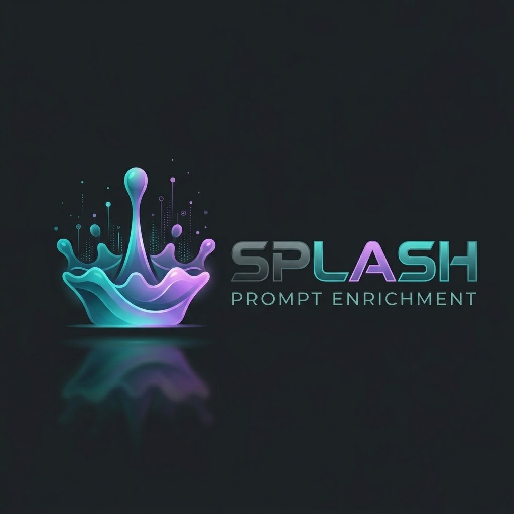

# Splash

<p align="center">
  
</p>

**A local prompt studio with diffusion models, evidence, and reversible decisions.**

Splash helps turn an initial idea into a clearer instruction for an LLM or agent. Each prompt lives in its own project, with an immutable main prompt, an editable working draft, context, suggested edits, and a history of every promotion. A model can propose a change; only you can make it the main prompt.

This release includes real diffusion inference, a persistent MCP tool host, and a complete local project workflow. Model execution has been measured on an RTX 2070, an RTX 5090, and a CPU. **Enrichment quality is still experimental:** models can repeat text, introduce assumptions, or miss semantic constraints. There is no custom-trained Splash checkpoint, and execution success is not a quality certification. See [measured results](#measured-hardware-and-quality) and [remaining model work](MODEL_ROADMAP.md).

## Start here

You need **Python 3.11 or later**, **Node.js 22.12 or later with npm**, and a current browser. Setup downloads application dependencies. Model packages and checkpoints are separate, larger downloads.

From the repository directory on Linux or macOS:

```sh
python3 scripts/setup.py --dev
python3 scripts/start.py
```

On Windows, use PowerShell:

```powershell
py -3 scripts/setup.py --dev
py -3 scripts/start.py
```

Open **http://127.0.0.1:8000**. Stop the server with Ctrl+C. No account or API key is required. Creating projects, editing, imports, history, and merges work before a model is installed. Enrichment and branches become available after a successful model load; there is no automatic mock fallback.

If port 8000 is busy, choose another port. To keep this checkout's data in a specific directory:

```sh
python3 scripts/start.py --port 8001 --data-dir .local-data
```

On Windows, replace `python3` with `py -3`. These launchers always bind to loopback. Splash is a single-user local application, not an authenticated public service.

### Manual installation

Linux/macOS:

```sh
python3 -m venv .venv
.venv/bin/python -m pip install -r backend/requirements-dev.txt
npm --prefix frontend ci
npm --prefix frontend run build
.venv/bin/python -m backend.app
```

Windows PowerShell:

```powershell
py -3 -m venv .venv
.\.venv\Scripts\python.exe -m pip install -r backend/requirements-dev.txt
npm --prefix frontend ci
npm --prefix frontend run build
.\.venv\Scripts\python.exe -m backend.app
```

The runtime dependencies, including the official `mcp==2.3.0` Python SDK, are pinned in [backend/requirements.txt](backend/requirements.txt). Node dependencies use the committed lockfile. Linux is the tested platform; Windows and macOS commands are provided, but their complete application and accelerator workflows have not been tested on those systems.

## Install and select a model

Install a PyTorch build appropriate to your operating system and GPU using the [official PyTorch installer](https://pytorch.org/get-started/locally/), then install the model adapters:

```sh
.venv/bin/python -m pip install -r backend/requirements-models.txt
```

On Windows use `.\.venv\Scripts\python.exe` in place of `.venv/bin/python` in all model commands. The tested Linux environment uses Python 3.14, PyTorch `2.14.1+cu130`, Transformers `4.57.6`, Accelerate `1.15.0`, and optional bitsandbytes `0.50.2`. To reproduce its modern NVIDIA runtime, where matching wheels are available:

```sh
.venv/bin/python -m pip install torch==2.14.1 --index-url https://download.pytorch.org/whl/cu130
.venv/bin/python -m pip install -r backend/requirements-models.txt
.venv/bin/python -m pip install bitsandbytes==0.50.2
```

Use a separate environment for an older GPU; the CUDA 13 profile is not the GTX 1050 profile. For CPU-only use, select the CPU wheel from PyTorch's installer and leave NF4 and CPU offload unchecked. For Apple Silicon, install the macOS PyTorch wheel and try the Metal device check; **Metal remains unverified in this release**, so CPU is the available fallback. A failed accelerator check is shown as an error and never changes the selected engine silently.

Open **Model & hardware**:

1. Scan the machine. Splash reports OS, CPU threads, RAM, disk space, GPU name and architecture, driver, and free VRAM. Device indices use PCI ordering.
2. Choose a model and device. Download the pinned checkpoint, or enter the directory of an existing complete checkpoint. Allow space for the download, extraction/cache metadata, and runtime memory.
3. Set the context budget and diffusion steps. Enable **NF4** for a compatible CUDA device with bitsandbytes installed. CPU offload is a separate, experimental option, with a default 6 GiB GPU / 24 GiB CPU budget.
4. Click **Load & run check**. The worker loads actual weights and runs a generation. The dialog reports the result, latency, and peak allocated GPU memory. The selected configuration is restored at the next application start.

All projects use this one model; agents supply different instructions and tool permissions. Changing the selected model replaces the worker's loaded model. Hugging Face downloads use pinned commit revisions and reuse partial downloads when retried. Downloaded models live under the application's `models/` directory. Checkpoints from your own directory are used in place.

The candidate checkpoints contain custom model code, loaded locally with `trust_remote_code=True`. Bundled downloads pin that code to these revisions; only select an existing checkpoint directory you trust.

| Profile | Checkpoint | Pinned revision | Approximate download | App context ceiling |
|---|---|---|---:|---:|
| Compact | [Qwen3-0.6B diffusion MDLM](https://huggingface.co/dllm-hub/Qwen3-0.6B-diffusion-mdlm-v0.1) | `c8d24a3f4adaeef46881b450e1bf7d1005203bd7` | 1.6 GB | 1,024 tokens |
| Balanced | [Dream-v0-Instruct-7B](https://huggingface.co/Dream-org/Dream-v0-Instruct-7B) | `05334cb9faaf763692dcf9d8737c642be2b2a6ae` | 15 GB | 2,048 tokens |
| Extended | [LLaDA2.1-mini](https://huggingface.co/inclusionAI/LLaDA2.1-mini) | `20e64e2ad21644d0e5248586ed9c942cdd45de0f` | 34 GB | 32,768 tokens |

These are application ceilings, including instructions, input, context, and output reservation; they are not guarantees that the maximum fits every device. NF4 reduces runtime weight memory, not the source checkpoint download. The LLaDA adapter uses its native confidence-based block/editing schedule; the diffusion-steps control applies to Compact and Dream. Local compatibility changes are documented in [backend/vendor/NOTICE](backend/vendor/NOTICE).

## Choose an agent and create a project

Click **New prompt project**, choose an agent, and enter the initial prompt. A project name is optional. The first main revision preserves the original text exactly; the draft starts as a copy.

| Agent | Use it for | Default output |
|---|---|---|
| **splash** | Clear, precise, readable graduate-level wording for general instructions | Polished prose |
| **splash-code** | Coding objectives, constraints, phases, tests, and acceptance criteria | Structured Markdown |
| **splash-search** | Scholarly research questions, methods, evidence standards, and related directions | Structured research brief |

The agent is fixed for the life of a project. Change the output style under **Context & sources** if you prefer prose. Use sidebar search and **Rename** to organize projects.

Input can be multilingual. The model is instructed to enrich in English while retaining code, identifiers, quotations, references, numbers, and constraints. Unsupported details should become questions, not asserted requirements. Explicit English requirements such as “Preserve…”, “Do not…”, and “Use only…” are retained in a labeled constraints section when the rewrite does not retain their wording. Literal/code/number checks and a limited multilingual testing-requirement check reject some other lossy outputs. They do **not** prove complete semantic equivalence; examine negations, scope, and implied obligations in the review.

### Imports and exports

- **Import as new** copies the current main into a new project, with an independently chosen agent.
- **Version history → Import into new project** can begin from any stored revision, including an archived main.
- Context pages and source records are copied, with origin metadata. The new project has its own history and remains usable after the source is deleted.
- **Export → Text/Markdown** exports the approved main, excluding unmerged draft changes.
- **Export → Complete project JSON** includes main history, saved drafts, variants, extracted context, sources, query history, and lineage. Merge-review tokens are excluded.
- **Import project archive** reads a Splash JSON export and starts a new project from its current main with copied context and evidence. It deliberately starts a fresh history; it is not an in-place database restore. Existing local projects are not overwritten. The archive's old history remains available in the exported JSON.

For a full restore of the exact application state, back up the SQLite database as described below.

## Drafts, suggestions, and explicit merges

The left panel is the current main. The right panel is the working draft. Typing autosaves after a short pause, without promoting anything. Live enrichment waits for idle input and adapts its delay to measured inference time; disable it for manual-only refinement.

**Refine entire prompt** produces edit cards. Each card shows the removed and added text. Research cards also include a rationale, evidence excerpt, source link, and evidence level. **Accept edit** or **Accept all** changes only the draft; **Dismiss** rejects a card. Stale edits cannot apply to a different draft revision.

Merge is always two stages:

1. **Review merge** displays the exact additions, removals, and attached source references between main and draft.
2. **Confirm merge & archive prior main** promotes that reviewed draft and retains the previous main in history, in one SQLite transaction.

**Keep editing**, Escape, or closing the review leaves the main unchanged. Any intervening draft or main revision change invalidates confirmation. Retrying the same successful confirmation returns the existing result rather than creating another main revision. Tab is ordinary keyboard navigation; it never promotes a prompt.

Example: begin with “Explain caching.” Refine and accept a draft that asks for two concrete examples. Review and confirm to create main version 2. If that version drifts from your intent, open version 1 in **Version history** and choose **Restore as draft**. Edit or promote it through the same review flow. Version 2 remains available.

### Recovery and concurrent editing

Main revisions are immutable. Autosaves also retain prior working drafts separately; **Include drafts & variants** reveals these entries. Every saved revision can be compared against the current main or restored as a new working draft.

The browser keeps a recovery copy of an unsaved draft. After reload or a connection interruption, Splash offers recovery when it differs from the saved version. If another tab changes the project, version checks prevent silent overwriting: resolve the conflict using the displayed recovery options. WebSocket connections retry automatically; job polling provides additional recovery. Keep the server running until the UI says **All changes saved** before closing it.

## Research branches and synthesis

For a **splash-search** project, open **Research branches**. Generate three cards by default; the selector permits one to five, and the server enforces the five-card ceiling.

- Select a single card and choose **Use branch as draft** to make a draft variant.
- Select two to five, or choose **Select all**, then **Synthesize selected** to combine the directions with the working prompt.
- The model is instructed to deduplicate overlap and put contradictory requirements under open questions. Review this result: conflict detection is model-assisted, not a formal guarantee.
- The prior working draft is preserved. The new variant records its originating main/draft, complete branch cards, condensed branch briefs, and source IDs.
- Branch generation uses the first 1,000 characters of the working draft and a bounded evidence brief; put the research objective early. Synthesis processes the full draft by section, carrying all selected branch briefs to each section.
- Selected cards are retained during background activity. Clear the selection before replacing them with newly generated cards.

Branch creation, selection, and synthesis never merge a main automatically. The synthesis is another draft to inspect, edit, and promote explicitly.

## Context and research tools

**Context & sources** accepts pasted notes, UTF-8 text, Markdown, code, and PDFs with extractable text. Limits are 8 MB per upload, 200 PDF pages, 500,000 extracted characters per document, and 30 documents per project. Prompt/draft text is limited to 80,000 characters; JSON imports are limited to 12 MB.

PDF page numbers, document names, and extracted passages are retained. **The stored attachment is extracted text with page references, not the original PDF binary or its layout.** Keep the original file separately. OCR, image interpretation, encrypted/image-only PDFs, and automatic repository inspection are outside this release.

Retrieval is local lexical passage ranking. Enrichment currently supplies at most one relevant 350-character excerpt to leave room on the smallest model profile. The UI reports excluded passages/characters and processed prompt sections; accepted context-based edits retain their passage and page provenance. Long prompts are split using the selected model's actual tokenizer without dropping input characters. Each section carries a short main-objective reminder. This preserves access to long input but cannot ensure global semantic consistency across sections.

### MCP architecture and permissions

FastAPI hosts one persistent bundled MCP server over stdio through the [official MCP Python SDK](https://github.com/modelcontextprotocol/python-sdk). All projects share this process and its public caches. Project-private documents remain scoped by a project ID supplied by the host, never chosen by a generated request.

| Read-only MCP tool | Purpose | Agent access |
|---|---|---|
| `search_context` | Rank passages from this project's uploads | All agents |
| `read_context` | Read a referenced passage from this project | All agents |
| `search_scholarly` | Search Semantic Scholar, Crossref, or optional Scholar | Coding/research, when enabled |
| `search_official_docs` | Search the supported documentation domains | Coding/research, when enabled |
| `fetch_source` | Fetch a public page or text PDF with provenance | Coding/research, when enabled |

Inference, database mutations, and merge confirmation stay in the application. Generated search calls are validated against schemas and agent permissions. A malformed plan gets one repair attempt, then deterministic retrieval. MCP failures appear as unavailable research and do not prevent local editing or model-only refinement; local context retrieval has an in-process fallback.

The host validates public destinations and every redirect, rejects private/local IPs and nonstandard ports, and pins requests to a validated address. Retrieved material is treated as evidence, never as authorization. There are no arbitrary third-party MCP servers or autonomous code execution tools.

### Research settings and provider behavior

Research is opt-in per coding/research project. Once enabled, the active visible project samples changed prompts about every ten seconds. Unchanged input is skipped, and only one research job per project runs at a time. **Research now** can request another cycle explicitly.

Each cycle has at most **two searches and three source fetches**, with provider timeouts/backoff and a two-minute cycle deadline. Editing cancels obsolete project jobs. Active enrichment has priority over research generation. Public results are cached in the tool process for 24 hours, up to 500 entries; the cache is shared but uploaded context is not placed in it.

Providers:

- **Semantic Scholar:** scholarly metadata and abstracts when available. Its unauthenticated API can return 429; Splash reports that limit and continues through the second provider.
- **Crossref:** publication metadata and available abstracts; metadata is not treated as full text.
- **Official documentation:** Bing's RSS search restricted to Python, MDN, TypeScript, React, Node.js, Rust, Go, Microsoft Learn, and GitHub Docs domains. Search availability and relevance can vary.
- **Supplied public URLs:** up to the remaining fetch budget, with redirect and destination validation. Private/intranet URLs are intentionally unavailable.
- **Google Scholar:** separately opt-in and experimental. Results are cached, requests are spaced at least one minute apart, and 403/429/CAPTCHA responses stop the scraper for that tool-server session. There is no CAPTCHA bypass. Scholar restricts automated access; see its [official guidance](https://scholar.google.com/intl/en/scholar/help.html). Use the other providers when unavailable.

Only focused query keywords are sent to search providers; uploaded documents are not sent wholesale. Keywords are derived from the working prompt, so avoid enabling external research on a prompt whose search terms must remain private. Source fetching contacts the requested public sites. Query history is visible in the project (latest 200 entries). Evidence is labeled as **snippet**, **metadata**, **abstract**, **passage**, or **full-text excerpt**; none of these labels certifies a claim. Fetched text is bounded, not necessarily a whole publication.

With a ready model, relevant excerpts can produce source-informed edit proposals. Without one, retrieval can still produce clearly labeled “evidence to consult” cards. Neither kind edits a draft without acceptance.

## Measured hardware and quality

Checks were run on October 6, 2026 UTC on Linux, an Intel Core Ultra 9 285K with approximately 64 GB RAM, NVIDIA driver 615.71.09, and the runtime above. Figures below are **individual small-prompt samples**, not percentiles, sustained throughput, startup/download time, or full UI latency. GPU memory is PyTorch peak allocated memory, not total device reservation.

| Device | Model / mode | Generation samples | Peak GPU allocation | Result |
|---|---|---:|---:|---|
| RTX 2070, 8 GB | Compact, FP16 | 2.23 s first / 1.08 s second | ~1,232 MiB | Runs; weak enrichment quality |
| RTX 5090, 32 GB | Compact, BF16 | 1.67 s first / 0.68 s second | ~1,232 MiB | Runs; weak enrichment quality |
| RTX 2070, 8 GB | Dream, NF4 | 11.30 s / 10.62 s | ~5,841 MiB | Runs; slower updates |
| RTX 5090, 32 GB | Dream, BF16 | 9.88 s first / 1.36 s second | ~14,842 MiB | Runs; preferable starting point on this machine |
| RTX 5090, 32 GB | LLaDA 2.1 mini, NF4 | 7.93 s / 14.11 s | ~9,993 MiB | Runs; slower, quality needs further evaluation |
| CPU, 4 inference threads | Compact, FP32 | 4.59 s / 4.68 s | Not applicable | CPU execution verified |
| GTX 1050 | Compact candidate | Not measured | Not measured | **Unverified on actual hardware** |
| Windows / Apple Metal | Candidate profiles | Not measured | Not measured | **Unverified** |

GPU samples use a 128-token output budget and 64 configured steps; LLaDA uses its own schedule and can stop early. CPU samples use only 64 output tokens and 16 steps, so their timings are not directly comparable. The larger model downloads do not imply they fit unquantized on an 8 GB GPU. Older Pascal devices need a compatible older PyTorch/CUDA environment, or CPU fallback; no specific GTX 1050 GPU installation is certified here.

Raw outputs and metrics:

- [Compact on both GPUs](artifacts/model-qualification.json)
- [Dream on RTX 5090](artifacts/dream-qualification.json) and [Dream NF4 on RTX 2070](artifacts/dream-2070-qualification.json)
- [LLaDA NF4](artifacts/llada-qualification.json) and [CPU fallback](artifacts/cpu-qualification.json)
- [Final live LLaDA enrichment check](artifacts/live-enrichment-check.json), with its explicit requirement preserved and both main/draft unchanged until acceptance
- [Five-branch LLaDA synthesis audit](artifacts/branch-synthesis-evaluation.json), including the consent omission that prompted the constraint-retention safeguard
- [Eight-case enrichment audit](artifacts/enrichment-evaluation.json), including English, Spanish, French, German, Chinese, and Arabic
- [Live research-provider checks](artifacts/provider-check.json)

The multilingual audit found useful English rewrites but also a dropped French testing requirement, awkward repetition, and limited research expansion. The new constraint guard catches that particular testing omission; general semantic fidelity and graduate-level quality remain review responsibilities. Compact often answers the task instead of improving the instruction. Longer outputs can end at the token limit. No model is represented as fully quality-qualified.

The UI and network remain separate from the worker. One generation runs at a time, the latest pending request wins, and obsolete generations stop between diffusion steps. Browser checks exercise typing during generation and autosave/reload; a formal cross-platform typing-latency percentile benchmark and process-wide peak RAM study remain future work. Research latency is recorded independently in provider checks.

## Storage, backups, and deletion

The default directory comes from `platformdirs`:

- Linux: typically `~/.local/share/Splash`
- Windows: typically `%LOCALAPPDATA%\Splash`
- macOS: `~/Library/Application Support/Splash`

The exact path appears in **Model & hardware**. `SPLASH_DATA_DIR` or the launcher's `--data-dir` overrides it. Configuration is read from the environment; a `.env` file is not loaded automatically.

`splash.sqlite3` contains projects, immutable main revisions, recoverable drafts, variants, extracted attachments, evidence, import lineage, settings, and the model configuration. SQLite uses WAL and transactional version checks. Model weights occupy `models/`, and CPU offload can occupy `offload/`. A configured external checkpoint remains in its original location. The browser also uses local storage for unsaved recovery data.

For a complete backup, stop Splash cleanly and copy its data directory (or use SQLite's online backup facility while running). Do not copy only the live `.sqlite3` file while omitting its WAL. Model weights can be downloaded again; the database cannot reconstruct deleted user prompts without a backup.

**Delete** permanently removes that project's stored history, drafts, context, and evidence from the app; export or back it up first. Independently imported projects survive. Deletion does not delete shared weights or external exports/backups, and is not a forensic secure erase of SQLite/WAL or storage media. Remove shared weights manually when no longer needed. Public caches disappear when the tool process stops. Local-only storage is not encryption; normal OS account and disk protections apply.

## Develop and verify

In separate terminals:

```sh
.venv/bin/python -m uvicorn backend.app:app --host 127.0.0.1 --port 8000 --reload --ws-max-size 100000
npm --prefix frontend run dev
```

Open http://127.0.0.1:5173. Vite proxies `/api`, `/ws`, and `/healthz` to the backend. Production builds serve from FastAPI. After changing frontend code outside Vite development mode, rebuild and reload the page.

```sh
.venv/bin/python -m unittest discover -s tests -v
npm --prefix frontend test
npm --prefix frontend run build
npm --prefix frontend audit
.venv/bin/python -m pip check
.venv/bin/python scripts/check_mcp.py
.venv/bin/python scripts/check_providers.py
```

Backend tests cover isolation, cross-agent imports, copied-context independence, Unicode, autosave conflicts, immutable history, exact diffs, stale/canceled/duplicate merges, transaction rollback, restoration, five-card enforcement, synthesis lineage, protected constraints, MCP permissions, malformed planning, provider failures, Scholar blocks, private-network rejection, WebSocket identity, and scheduler cancellation. Frontend tests cover serialized autosave, recovery, conflict handling, safe source links, and connection behavior. MCP/provider scripts contact real processes/public services; their outputs can differ with network availability.

To repeat actual model qualification, allowing checkpoint downloads only when requested:

```sh
.venv/bin/python scripts/qualify_models.py --models compact --devices cuda:0 cuda:1 --download
.venv/bin/python scripts/qualify_models.py --models dream --devices cuda:0 --quantize --output artifacts/dream-2070-qualification.json
.venv/bin/python scripts/qualify_models.py --models llada --devices cuda:1 --quantize --output artifacts/llada-qualification.json
```

Inspect your device indices first. The qualification script uses repository-local `.models/`; the app's download button uses its app-data directory. Point the model dialog at `.models/<model>` to reuse script downloads. `scripts/evaluate_enrichment.py` is the small Dream/RTX-5090 quality audit; adjust its explicit device configuration before running elsewhere.

### Application interfaces

Interactive HTTP documentation is available at **http://127.0.0.1:8000/docs**. Principal endpoints:

| Route under `/api` | Action |
|---|---|
| `/projects` | List/search and create; creation can name a source project/revision |
| `/projects/{id}` | Read, rename/configure, or delete |
| `/projects/{id}/draft` | Save with `expected_version` |
| `/projects/{id}/merge-review` | Capture the exact main/draft comparison |
| `/projects/{id}/merge/{review_id}` | Confirm idempotently, or cancel with DELETE |
| `/projects/{id}/restore` | Restore a revision as a draft |
| `/projects/{id}/compare/{revision_id}` | Compare a saved revision to the current main |
| `/projects/{id}/documents` | Upload context |
| `/projects/{id}/refine` | Start proposal generation |
| `/projects/{id}/branches/generate`, `/select`, `/synthesize` | Manage branch cards and variants |
| `/projects/{id}/research`, `/jobs` | Research and job status |
| `/projects/{id}/export`, `/projects/import-file` | Export an archive/prompt or import an archive |
| `/hardware`, `/models`, `/models/download`, `/models/load` | Inspect and manage shared inference |

`/ws/projects/{id}` emits protocol-2 events scoped to that project: `project_changed`, `progress`, `job_complete`, `job_error`, `job_canceled`, and `project_deleted`. Project-change events include agent, main ID, and draft version. Job results carry proposals, context accounting, research results, or variants. Mutations remain validated HTTP operations.

The earlier deterministic mock remains isolated in `backend/engine.py` and legacy `/ws` for regression coverage. Its responses explicitly say `engine: "mock"`; the project studio never uses it. The old `tests/test_latency.py` measures that mock protocol only and must not be cited as diffusion-model performance.

### Code map

- `backend/storage.py`: transactional project store and revision invariants.
- `backend/api.py`: project/model HTTP APIs and scoped WebSocket events.
- `backend/models.py`: hardware inspection, adapters, and persistent inference process.
- `backend/agents.py`: policies, proposals, branches, synthesis, and research scheduling.
- `backend/mcp_host.py`, `mcp_server.py`, `research.py`: shared MCP lifecycle, permissions, local retrieval, and public providers.
- `frontend/src/app.jsx`, `components/StudioParts.jsx`, `client.js`: project UI, merge review, and serialized draft recovery.
- `frontend/src/assets/splash-logo.jpg`: original Splash logo, shared by the app and this README. `frontend/src/index.css` defines the charcoal, teal, and violet theme with reusable color variables.
- `tests/`, `frontend/tests/`, `scripts/`, `artifacts/`: regression tests and reproducible qualification records.
- `mobyMinutes/`: historical design/build records, not the current runtime specification.

## Troubleshooting

| Symptom | What to do |
|---|---|
| Model controls say no model is ready | Install PyTorch/model requirements, download or select a checkpoint, then load it. Editing/history remain available. |
| CUDA unavailable or GPU scan fails | Run `nvidia-smi` in a normal local terminal. A sandbox permission failure does not prove the GPU or driver is absent. Match the runtime to the architecture. |
| GPU out of memory | Reduce context, choose Compact, or try the measured Dream NF4 profile with bitsandbytes. Check other GPU processes. Offload is experimental and slower. |
| Model import or custom-code error | Use the pinned requirements and matching catalog checkpoint. LLaDA requires the bundled eager-mask/RoPE compatibility path. Do not mix a random Transformers major version into the tested environment. |
| A rewrite is rejected for omitted content | The draft is intact. Try another model or diffusion schedule, or refine a smaller task. Review semantic constraints even when the guard passes. |
| Research returns 429, CAPTCHA, or no results | Other providers may continue. Wait for backoff, try a focused query, or supply a public source URL. Scholar blocking is not bypassed. |
| MCP tools are unavailable | Local editing still works. The host retries server startup automatically; inspect backend stderr and verify the pinned MCP dependency in the same virtual environment. |
| Unsaved changes or a stale-merge error | Resolve the displayed recovery/conflict choice, save the draft, and open a new merge review. Never force an old review onto a new revision. |
| PDF yields no text | Use a text-based PDF or paste a transcription; OCR is outside scope. |
| UI shows old content or is not built | Run `npm --prefix frontend run build`, then reload. Restart the backend after backend changes. |
| Tests hang in a restricted sandbox | Run in a normal local terminal with loopback socket access. In-process WebSocket tests still need event-loop socket facilities. |
| Port already in use | Start with `python3 scripts/start.py --port 8001` or stop your previous Splash instance. |

Custom training, stronger multilingual/constraint evaluation, certified GTX 1050/Windows/Metal profiles, richer retrieval, cloud synchronization, native desktop packaging, arbitrary external MCP servers, and autonomous code execution are future work. See [MODEL_ROADMAP.md](MODEL_ROADMAP.md) for the remaining model-specific work.
